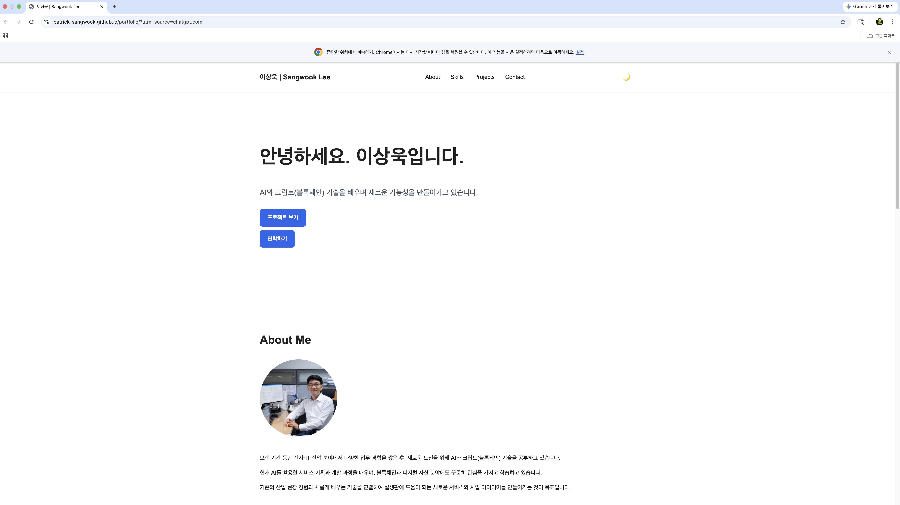
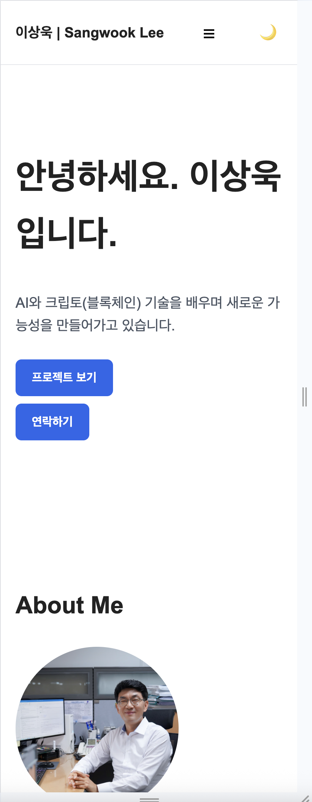
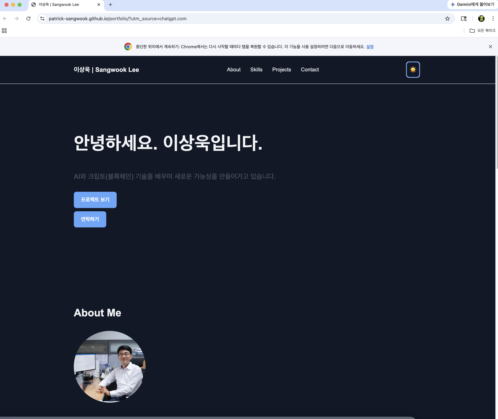

# Personal Portfolio

개인 포트폴리오 웹사이트입니다.

AI와 웹 개발을 학습하면서 HTML, CSS, JavaScript를 활용하여
처음부터 직접 제작한 반응형 포트폴리오 웹사이트입니다.


## 1. 최종 결과물과 구현 내용

### 1) 반응형 웹사이트

**미션 요구사항**  
모바일, 태블릿, 데스크톱 등 다양한 환경에서 레이아웃이 최적화되어 보이고,
Hero, About, Skills, Projects, Contact, Footer 섹션을 포함

>> Mobile First 방식으로 웹사이트를 제작하고 768px, 1024px을 기준으로
반응형 레이아웃을 적용  
Hero, About, Skills, Projects, Contact, Footer 영역을 각각 구성


### 2) 인터랙티브 UI

**미션 요구사항**  
다크 모드, 햄버거 메뉴, 부드러운 스크롤, 스크롤 애니메이션 등의
사용자 인터랙션과 폼 유효성 검사가 동작해야 합니다.

>> JavaScript의 이벤트 처리를 이용하여 다크 모드와 모바일 햄버거 메뉴를 구현
또한 Smooth Scroll, Scroll Top Button, 스크롤에 따른 Navigation 변화,
Intersection Observer를 이용한 Scroll Animation을 구현

Contact Form에서는 이름, 이메일, 메시지의 입력값을 검사하고
잘못된 입력에 대한 오류 메시지를 표시하도록 구현


### 3) 외부 API 연동

**미션 요구사항**  
GitHub API에서 본인의 저장소 목록을 가져와 Projects 섹션에 동적으로 표시하고,
로딩, 성공, 에러, 빈 상태를 UI로 표현해야 합니다.

>> GitHub REST API와 `fetch`, `async/await`를 이용하여
GitHub 저장소 정보를 가져오도록 구현

가져온 데이터는 `map()`을 이용하여 프로젝트 카드로 변환하고,
로딩 중, 정상 조회, 데이터 없음, API 오류 상태에 따라
Projects 영역의 화면이 다르게 표시되도록 구현

API 오류 발생 시 다시 요청할 수 있는 Retry 버튼도 구현


### 4) 상태 유지

**미션 요구사항**  
다크 모드 설정을 LocalStorage에 저장하여 새로고침 후에도 유지해야 합니다.

>> 사용자가 선택한 Light/Dark Mode 값을 LocalStorage에 저장하고,
페이지를 다시 열거나 새로고침 했을 때 저장된 테마를 불러오도록 구현


### 5) 배포

**미션 요구사항**  
GitHub Pages를 이용하여 외부에서 접속 가능한 웹사이트로 배포해야 합니다.

>> 완성된 프로젝트를 Git을 이용하여 GitHub Repository에 업로드하고,
GitHub Pages를 이용하여 실제 웹사이트로 배포


## 2. 과제 목표와 내가 이해한 내용

### 1) HTML에서 시맨틱 태그를 왜 사용하는가? 어떤 기준으로 구조를 설계했는가?

시맨틱 태그는 각 영역이 어떤 역할을 하는지 HTML 구조만 보고도
쉽게 이해할 수 있도록 사용

이번 프로젝트에서는 페이지의 역할에 따라
`header`, `nav`, `main`, `section`, `article`, `footer`로 구조를 나눔

단순히 모든 영역을 `div`로 만드는 것이 아니라
각 콘텐츠의 의미와 역할을 기준으로 HTML 구조를 설계


### 2) Flexbox와 Grid의 차이는 무엇이고 언제 사용하는가?

Flexbox는 한 방향을 중심으로 요소를 배치할 때 사용하기 편하고,
Grid는 행과 열을 이용하여 여러 요소를 배치할 때 적합

이번 프로젝트에서는 Navigation의 로고와 메뉴를 배치하기 위해
Flexbox를 사용

Projects 영역에서는 여러 프로젝트 카드를 화면 크기에 따라
자동으로 배치하기 위해 Grid의 `auto-fit`과 `minmax()`를 사용


### 3) querySelector와 addEventListener는 어떻게 사용하는가?

`querySelector`와 `querySelectorAll`은 JavaScript에서
HTML 요소를 찾아 선택하기 위해 사용

선택한 요소에 `addEventListener`를 연결하면
클릭, 입력, 스크롤, 폼 제출 등의 사용자 행동이 발생했을 때
원하는 JavaScript 기능을 실행할 수 있음

이번 프로젝트에서는 다크 모드 버튼, 햄버거 메뉴, 스크롤 버튼,
Contact Form 등에 이러한 방식을 사용


### 4) 화살표 함수, 구조분해 할당, 배열 메서드(map/filter)는 왜 사용하는가?

화살표 함수는 함수를 간결하게 작성할 수 있는 JavaScript 문법

구조분해 할당은 객체에서 필요한 데이터를 쉽게 꺼내 사용할 수 있도록 해줌
GitHub API 데이터에서 프로젝트 이름, 설명, 사용 언어, URL을 가져올 때 사용

`map()`은 GitHub에서 받은 여러 프로젝트 데이터를 각각 HTML 카드로
변환하기 위해 사용

`filter()`는 특정 조건에 맞는 데이터만 선택할 때 사용하는 메서드


### 5) fetch와 async/await로 비동기 데이터를 어떻게 처리했는가?

`fetch`는 외부 API에 데이터를 요청할 때 사용하고,
`async/await`는 API의 응답을 기다린 후 다음 작업을 처리하기 위해 사용

이번 프로젝트에서는 GitHub API에 저장소 정보를 요청하고,
응답을 JSON 데이터로 변환한 다음 프로젝트 카드로 화면에 표시

`try/catch`를 이용하여 요청 과정에서 오류가 발생하는 경우도 처리했으며,
로딩, 성공, 에러, 빈 상태에 따라 서로 다른 화면이 표시되도록 구현


### 6) 이벤트 → 상태 변경 → DOM 업데이트는 어떻게 연결되는가?

사용자가 어떤 행동을 하면 이벤트가 발생하고,
JavaScript가 현재 상태를 변경한 후 그 결과를 다시 화면에 표시하는 흐름

예를 들어 다크 모드 버튼을 클릭하면 테마 상태가 Light 또는 Dark로 변경되고,
변경된 상태에 따라 웹사이트의 색상이 바꿈

Contact Form에서는 사용자가 입력하고 제출하면 입력값을 검사한 후
정상 또는 오류 상태에 따라 메시지가 화면에 표시

GitHub API에서도 데이터를 요청한 후
로딩, 성공, 에러 등의 상태에 따라 Projects 영역의 화면이 변경


## 3. 주요 기능

- **반응형 웹 디자인 (Mobile First)**  
  모바일 화면을 기본으로 제작하고 화면 크기에 따라 레이아웃이 변경

- **768px / 1024px Breakpoint**  
  태블릿과 데스크톱 화면 크기를 기준으로 반응형 디자인을 적용

- **Light / Dark Mode**  
  버튼을 클릭하여 밝은 화면과 어두운 화면을 전환할 수 있음

- **Dark Mode 설정 LocalStorage 저장**  
  선택한 테마를 브라우저에 저장하여 새로고침 후에도 유지

- **모바일 Hamburger Menu**  
  모바일 화면에서는 메뉴를 숨기고 햄버거 버튼으로 열고 닫을 수 있음

- **Smooth Scroll**  
  Navigation 메뉴를 클릭하면 해당 영역으로 부드럽게 이동

- **Scroll Top Button**  
  300px 이상 스크롤하면 버튼이 나타나며 클릭하면 페이지 맨 위로 이동

- **스크롤에 따른 Navigation 변화**  
  60px 이상 스크롤하면 Header의 배경과 그림자가 변경

- **Intersection Observer Scroll Animation**  
  각 Section이 화면에 나타날 때 자연스럽게 표시되는 애니메이션을 적용

- **Contact Form 입력값 검증**  
  이름, 이메일, 메시지의 필수 입력 여부와 이메일 형식을 검사

- **GitHub API 프로젝트 자동 표시**  
  GitHub Repository 정보를 API로 가져와 Projects 카드로 자동 생성

- **GitHub API Loading / Empty / Error 상태 처리**  
  API의 처리 상태에 따라 로딩, 정상 조회, 데이터 없음, 오류 화면을 표시

- **API 오류 발생 시 Retry 기능**  
  API 요청에 실패한 경우 다시 시도할 수 있는 버튼을 제공


## 4. 사용 기술

- HTML5
- CSS3
- JavaScript (ES6+)
- Git & GitHub
- GitHub REST API


## 5. JavaScript 학습 내용

프로젝트를 제작하면서 다음 JavaScript 기능을 활용했습니다.

- **Arrow Function**  
  함수를 보다 간결한 형태로 작성하기 위해 사용

- **Template Literal**  
  GitHub 프로젝트 데이터를 HTML 코드 안에 동적으로 넣기 위해 사용

- **Destructuring**  
  GitHub API 객체에서 이름, 설명, 언어, URL 등의 필요한 값을 추출

- **map()**  
  GitHub 프로젝트 배열을 각각의 HTML 프로젝트 카드로 변환

- **forEach()**  
  여러 Navigation 링크와 Section 등의 요소를 하나씩 순회하며 기능을 적용

- **querySelector / querySelectorAll**  
  JavaScript에서 제어할 HTML 요소를 선택

- **classList**  
  `add`, `remove`, `toggle`을 이용하여 메뉴, 스크롤 효과 등의 CSS 클래스를 변경

- **addEventListener**  
  click, submit, scroll, input 등의 사용자 이벤트를 처리

- **fetch()**  
  GitHub REST API에 프로젝트 데이터를 요청

- **async / await**  
  API의 비동기 응답을 기다리고 순서대로 처리

- **try / catch**  
  GitHub API 요청 과정에서 발생하는 오류를 처리

- **localStorage**  
  사용자가 선택한 Light/Dark Mode 설정을 브라우저에 저장

- **Intersection Observer**  
  Section이 화면에 나타나는 시점을 감지하여 Scroll Animation을 실행


## 6. 프로젝트 폴더 구조

프로젝트의 HTML, CSS, JavaScript, 이미지 파일을 역할별로 분리하여 관리

```text
portfolio/
├── index.html
├── README.md
├── css/
│   └── style.css
├── js/
│   └── main.js
└── images/
    ├── profile.jpg
    ├── desktop.png
    ├── mobile.png
    └── dark-mode.png
```

## 7. Deployment

GitHub Pages를 이용하여 배포했습니다.

배포 사이트: https://patrick-sangwook.github.io/portfolio/

## 8. Screenshots

### Desktop



### Mobile



### Dark Mode



## 9. Author

**이상욱 | Sangwook Lee**

GitHub: Patrick-sangwook